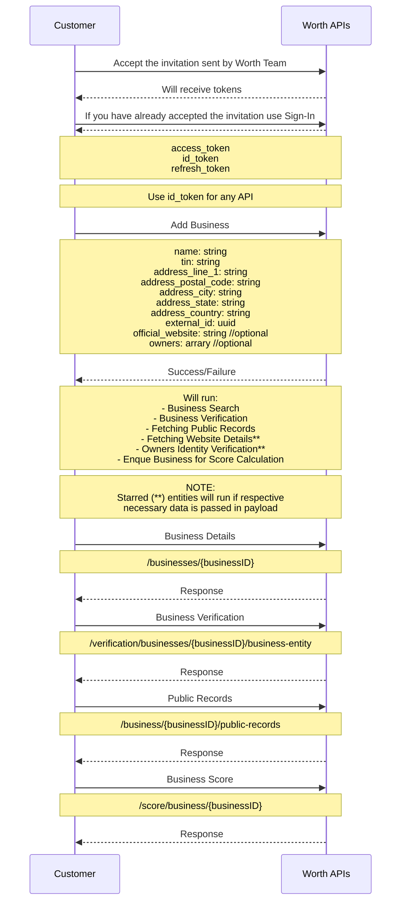

<!-- Source: https://docs.worthai.com/use-cases/onboarding/instant-onboarding.md -->
# Instant onboarding

> ## Documentation Index
> Fetch the complete documentation index at: https://docs.worthai.com/llms.txt
> Use this file to discover all available pages before exploring further.

# Instant onboarding

This sequence diagram illustrates a streamlined business onboarding process through Worth AI's APIs, focusing on submitting all data at once for handling by the system.

***

## **Process breakdown**

### **1. Onboarding API calls**

* **Authentication**:\
  Upon accepting initial invitation or signing in, the customer receives the following tokens:

  * **access token**: used for purposes like logout, update password etc.
  * **id token**: used for secure api communication. (**recommended for all api calls.**)
  * **refresh token**: to renew Access and ID token.

  **Note**: always use the **id token** for secure api communication.  see [this page](https://docs.worthai.com/api-reference/auth/sign-in/customer-sign-in) for more info.

* **Submit business data**:\
  The customer provides business information in the following structure:

  ```json theme={null}
  {
    "name": "string",
    "tin": "string",
    "external_id": "uuid",
    "address_line_1": "string",
    "address_postal_code": "string",
    "address_city": "string",
    "address_state": "string",
    "address_country": "string",
    "official_website": "string (optional)",
    "owners": "array (optional)"
  }
  ```

  This triggers the system to perform multiple onboarding tasks. See [Add Business documentation](http://docs.worthai.com/api-reference/add-or-update-business/add-business) for further information.

***

### **2. Worth AI System Actions**

Upon receiving the business data, the system performs the following tasks:

* **Business Search**:\
  Identifies and verifies the business in the system.

* **Business Verification**:\
  Validates business details such as legal standing and ownership information.

* **Fetching Public Records**:\
  Retrieves relevant public records associated with the business.

* **Fetching Website Metadata**:\
  Gathers metadata from the business's official website if provided.

* **Owners’ Identity Verification**:\
  Verifies the identity of the business owners based on the provided data.

* **Business Scoring**:\
  Calculates the business score, evaluating creditworthiness and other key metrics.

***

### **3. Retrieve Data**

The following endpoints allow you to fetch data for a specific business:

* **Fetch business data**:\
  Retrieves detailed information about a specific business by its unique ID.\
  **API Endpoint**: [`/businesses/{businessID}`](https://docs.worthai.com/api-reference/case/businesses/get-business-by-id)

* **Fetching Public Records**:\
  Retrieves relevant public records found that are associated with the business.\
  **API Endpoint**: [`/business/{businessID}/public-records`](https://docs.worthai.com/api-reference/integration/public-records/public-records)

* **Business Verification**:\
  Retrieves business details such as legal standing and ownership information when available.
  **API Endpoint**: [`/verification/businesses/{businessID}/business-entity`](https://docs.worthai.com/api-reference/integration/verification/get-verification-details)

* **Fetching Website Metadata**:\
  Gathers metadata from the business's official website if provided.
  **API Endpoint**: [`/verification/businesses/{businessID}/website-data`](https://docs.worthai.com/api-reference/integration/verification/get-business-website-data)

* **Business Scoring**:\
  Retrieves the calculated business score.\
  **API Endpoint**: [`/score/businesses/{businessID}`](https://docs.worthai.com/api-reference/score/score/get-business-score)

***

### **4. Update Business Data**

Continue to provide business details as data becomes available for you

* **Update business data**:\
  Update business details via PATCH requests.\
  **API Endpoint**: [`/add-or-update-business/update-business`](https://docs.worthai.com/api-reference/add-or-update-business/update-business)

***

**Give all data once and let us do the stuff for you!!**

<br />


