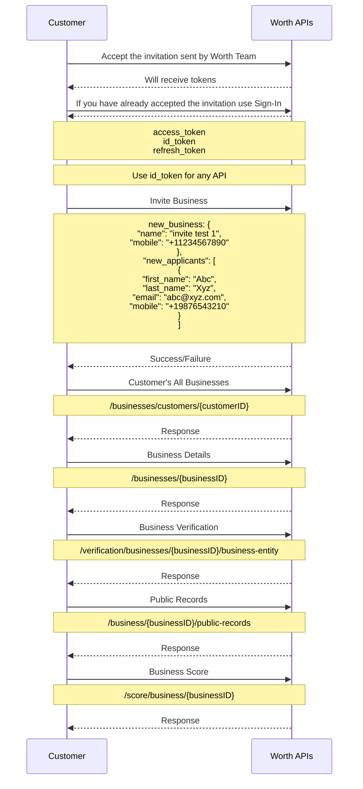

<!-- Source: https://docs.worthai.com/use-cases/onboarding/invite-business.md -->
# Invite business

> ## Documentation Index
> Fetch the complete documentation index at: https://docs.worthai.com/llms.txt
> Use this file to discover all available pages before exploring further.

# Invite business

This sequence diagram demonstrates the efficient business onboarding process facilitated by Worth UI, where invitations are sent to businesses, guiding them through a seamless registration and onboarding experience via the platform.

***

## **Process breakdown**

### **1. Onboarding API calls**

* **Authentication**:\
  Upon accepting initial invitation or signing in, the customer receives the following tokens:

  * `id_token`: used for secure api communication. (**required for all api calls.**)
  * `refresh_token`: is used to renew `id_token`.

  **Note**: `id_token` is always required for secure api communication. See [Customer Sign In page](https://docs.worthai.com/api-reference/auth/sign-in/customer-sign-in) for more info.

* **Invite Business**:\
  The customer provides business information in the following structure:
  ```json  theme={null}
    {
        "business": {
            "name": "Business Name",
            "mobile": "1234567890"
        },
        "applicants": [
            {
                "first_name": "Applicant First Name",
                "last_name": "Applicant Last Name",
                "email": "applicant@email.com",
                "mobile": "1234567890"
            }
        ]
    }
  ```
  * **Lightning Verification**:\
    **Lightning Verify** instantly checks and confirms company details. It gathers information like a company's name, address, and Taxpayer Identification Number (TIN) into a single, customizable form that applicants fill out. Upon submission, verification results are available in the Worth Case Management Platform.\
    **Getting started**: Contact your Worth Custom Success team to enable Lightning Verify.
    ```json  theme={null}
      {
          "business": {
              "name": "Business Name",
              "mobile": "1234567890"
          },
          "applicants": [
              {
                  "first_name": "Applicant First Name",
                  "last_name": "Applicant Last Name",
                  "email": "applicant@email.com",
                  "mobile": "1234567890"
              }
          ],
          "is_lightning_verify": true
      }
    ```

This triggers email to applicant to complete the onboarding process. See [Send Business Invite documentation](https://docs.worthai.com/api-reference/case/invites/send-business-invite) for further information.

***

### **2. Worth AI System Actions**

Upon sending invite, an email with invite link will be sent to the applicant on the email provide. Once the applicant submitted the onboarding you can retrieve the business information using this [APIs](https://docs.worthai.com/use-cases/onboarding/instant-onboarding#3-retrieve-data).

Also you can use [webhooks](https://docs.worthai.com/webhooks/business) to get the business status and information.

***

### **3. Retrieve Data**

To fetch all businesses:

* **Fetch all business**:
  Retrieves all businesses information
  **API Endpoint**: [`/businesses/customers/{customerID}`](https://docs.worthai.com/api-reference/case/businesses/get-customer-businesses)

The following endpoints allow you to fetch data for a specific business:

* **Fetch business data**:\
  Retrieves detailed infromation about a specific busienss by its unique ID.\
  **API Endpoint**: [`/businesses/{businessID}`](https://docs.worthai.com/api-reference/case/businesses/get-business-by-id)

* **Fetching Public Records**:\
  Retrieves relevant public records found that are associated with the business.\
  **API Endpoint**: [`/business/{businessID}/public-records`](https://docs.worthai.com/api-reference/integration/public-records/public-records)

* **Business Verification**:\
  Retrieves business details such as legal standing and ownership information when available.
  **API Endpoint**: [`/verification/businesses/{businessID}/business-entity`](https://docs.worthai.com/api-reference/integration/verification/get-verification-details)

* **Fetching Website Metadata**:\
  Gathers metadata from the business's official website if provided.
  **API Endpoint**: [`/verification/businesses/{businessID}/website-data`](https://docs.worthai.com/api-reference/integration/verification/get-business-website-data)

* **Business Scoring**:\
  Retrieves the calculated business score.\
  **API Endpoint**: [`/score/businesses/{businessID}`](https://docs.worthai.com/api-reference/score/score/get-business-score)

***

**Send invitation to business and let them onboard using Worth UI!!**

<br />




Built with [Mintlify](https://mintlify.com).