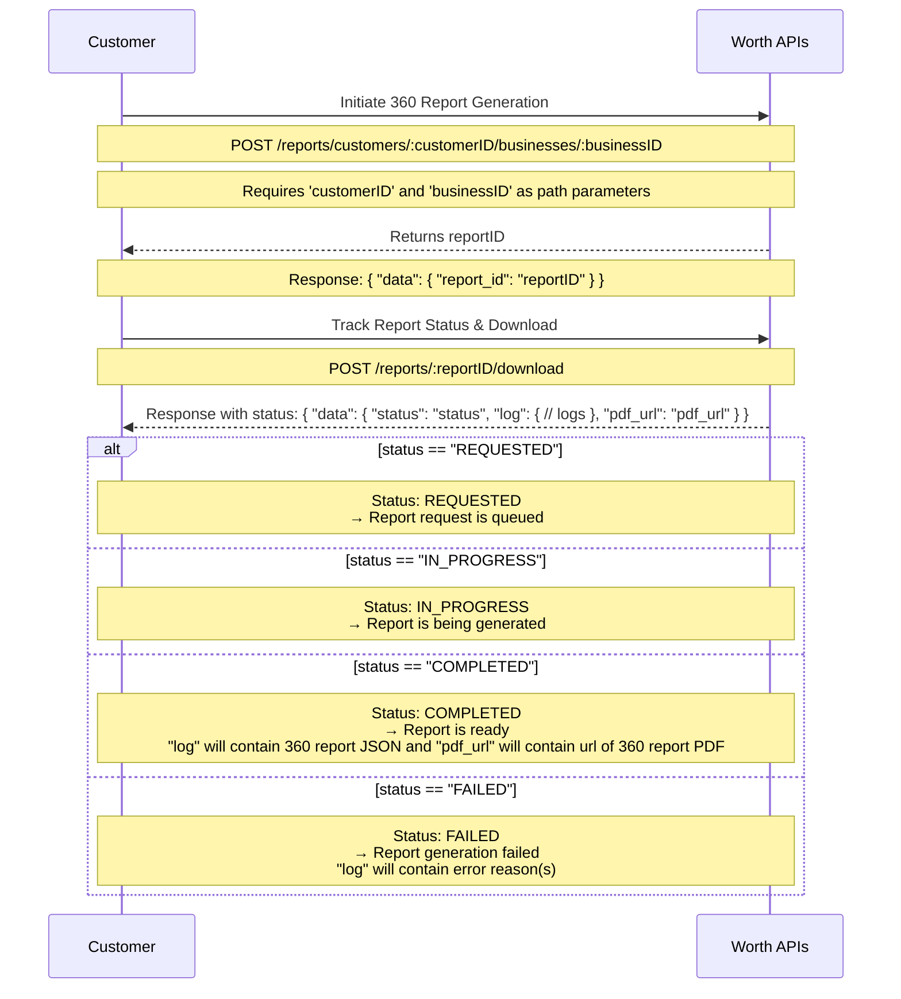
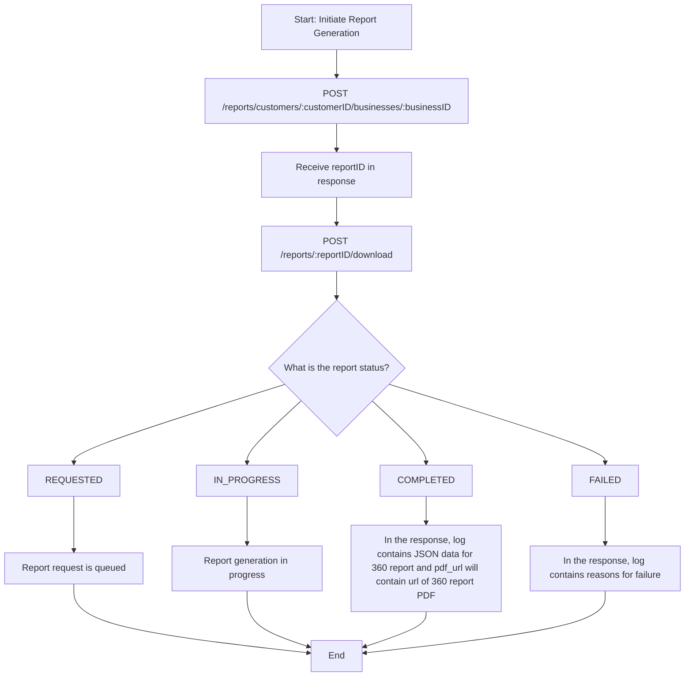

<!-- Source: https://docs.worthai.com/use-cases/worth-360-report/process-diagrams.md -->
# Process diagrams

> ## Documentation Index
> Fetch the complete documentation index at: https://docs.worthai.com/llms.txt
> Use this file to discover all available pages before exploring further.

# Process diagrams

These diagrams illustrates the flow of generating a Worth 360 Report using Worth AI APIs, starting from initiating the report to retrieving the final output or failure reason.

***

**Sequence diagram for Worth 360 Report!!**

 

 

 

 

**Flochart for Worth 360 Report!!**

 

